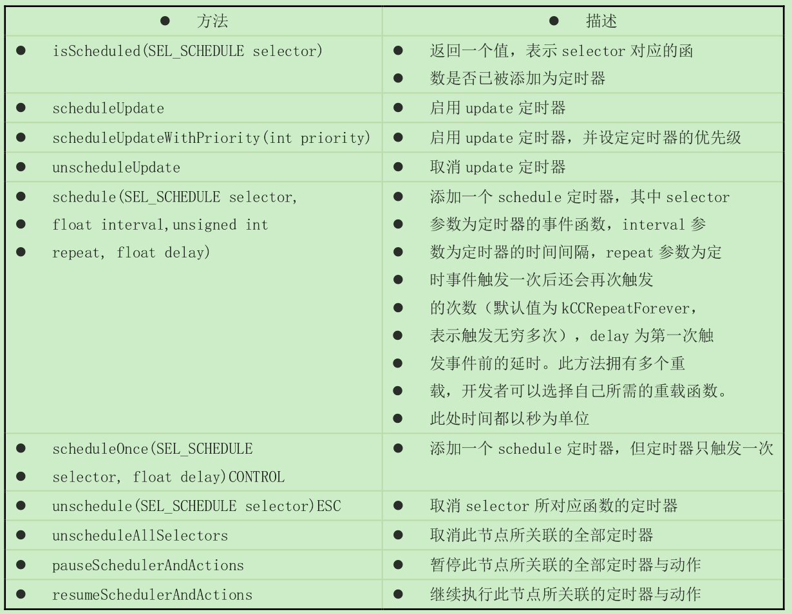
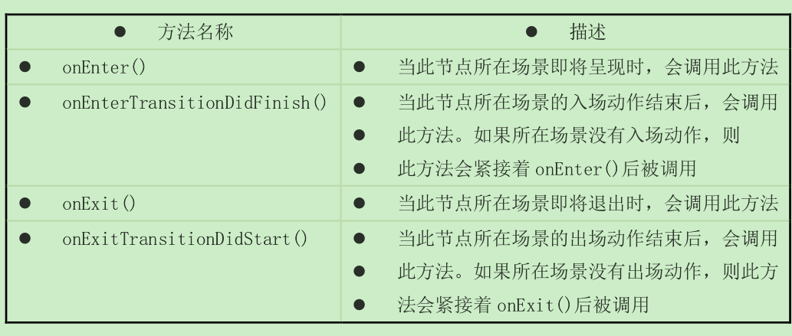

# 06 事件调度

## 定时器事件——update和schedule

### update 定时器
-  update 方法法在每帧绘制之前都调用一次。
- CCNode 默认并没有启用 update 事件，为了启用定时器，我们需要调用 scheduleUpdate 方法，并重载 update 以执行自己的代码。对应地，我们可以使用 unscheduleUpdate 方法停止定时器。

### schedule 定时器
>  schedule 可以实现以一定的时间间隔连续调用某个函数。这里的时间间隔必须大于两帧的间隔，否则两帧期间的多次调用会被合并成一次调用。所以 schedule 定时器通常用在间隔较长的定时调用中，一般来说，事件间隔应在 0.1 秒以上。实际开发中，许多定时操作都通过 schedule 定时器实现。

```C++
this->schedule(schedule_selector(GameScene::updateGame));
void GameScene::updateGame(ccTime dt)
{
 SpriteLayer* sLayer = (SpriteLayer*)this->getChildByTag(sprite_layer_tag);
 sLayer->updateFishMovement(dt);
 sLayer->checkBulletCollideWithFish();
}
```

- schedule 方法接受一个函数指针并启动一个定时器，利用 schedule 方法不同的重载可以指定触发间隔与延时
- schedule_selector 则是一个把指定函数转换为函数指针的宏，用于创建 schedule 方法所需的函数指针
- Cocos2d-x 的调度是纯粹的串行机制，因此所有函数都运行在同一个线程，不会存在并行程序的种种麻烦，这大大简化了编程的复杂性。




## 其他事件
> 这些事件的默认实现通常负责处理定时器和动作的启用与暂停，因此必须在重载方法中调用父类的方法。



